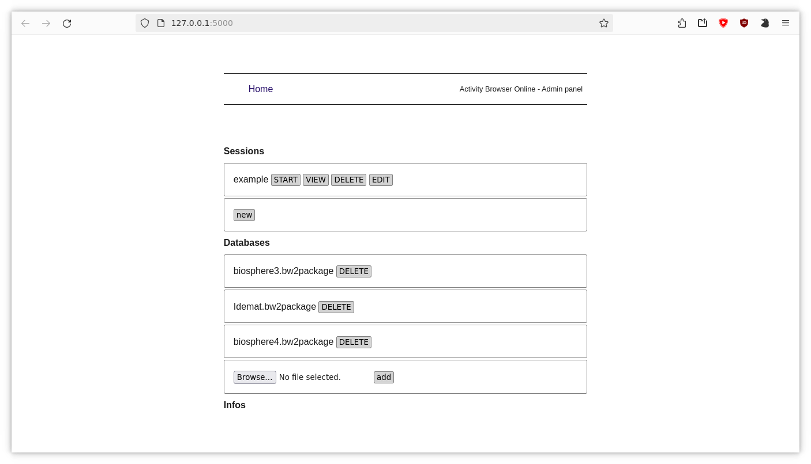

# Activity Browser Online Admin

A web admin interface for Activity Browser Online.

This project contains a Flask server that can be used to manage [Activity Browser Online](https://github.com/Pan6ora/activity-browser-online) session. Putted behind a login management system this can be used to give administrators an interface to manage AB Online installed on a server.

## About Activity Browser Online

Launch reproducible [Activity Browser](https://github.com/LCA-ActivityBrowser/activity-browser) sessions and distribute them using NoVNC.

## Quickstart

See [Activity Browser Online documentation](https://activity-browser-online.readthedocs.io/en/latest/usage/quickstart.html) for how to install and setup AB Online and AB Online Admin.

## Developer quickstart

To ensure having the last bug fix of Activity Browser Online use the git version:

```
# clone repositories
git clone https://github.com/Pan6ora/activity-browser-online.git
git clone https://github.com/Pan6ora/ab-online-admin.git

# create conda environment
conda create -n ab-online-web -c pan6ora activity-browser-online
conda activate ab-online-web

# install local version of activity browser online
cd activity-browser-online
pip install -e .

# start ab-online-web development server
cd ../ab-online-admin
flask --app main run --debug
```

## Screenshots



